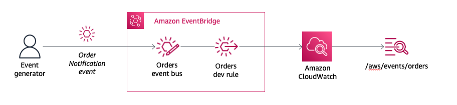

# Building AWS Event-Driven Architecture

## First event bus and targets

## Simple Event Bus

In this module, you will create a custom EventBridge event bus, Orders, and an EventBridge rule, OrderDevRule, which matches all events sent to the Orders event bus and sends the events to a CloudWatch Logs log group, /aws/events/orders. See the diagram above:

The technique of logging all events to CloudWatch Logs is useful when implementing EventBridge rules.

Step 1: Create a custom event bus
Open the AWS Management Console for EventBridge  in a new tab or window, so you can keep this step-by-step guide open.

On the EventBridge homepage, under Events, select Event buses from the left navigation.

EventBridge Console

Click Create event bus.

Create Bus

Name the event bus Orders.

Leave Event archive and Schema discovery disabled, Resource-based policy blank.

Click Create.

Create Bus

Step 2: Set up Amazon CloudWatch target (for development work)
A simple way to test and get rapid feedback for the rules you create for your event bus is to use Amazon CloudWatch as a target. We will create a rule for the Orders bus that will act as a "catch-all" for every event passed to the bus, irrespective of source.

All events warning
When All events is selected as the event source, EventBridge will send every event that comes to this event bus to this rule. This may result in an extremely high number of target invocations and incur additional costs. In addition, it is possible to create rules that lead to infinite loops, where a rule is triggered repeatedly. To prevent this, we recommend you write rules so that the triggered actions do not re-trigger the same rule. In this workshop we will scope all events coming from the source com.aws.orders
From the left-hand menu, select Rules.

From the Event bus dropdown, select the Orders event bus

Click Create rule New rule

Define rule detail:

Add OrdersDevRule as the Name of the rule
Add Catchall rule for development purposes for Description
Select Rule with an event pattern for the Rule type
Create Bus

In the next step, Build event pattern

under Event source, choose Other
Create Bus

Under Event pattern, further down the screen, enter the following pattern to catch all events from com.aws.orders:
1
2
3
{
   "source": ["com.aws.orders"]
}

Select next.
Take this opportunity to familiarize yourself with some the options available for AWS services, there are many examples of pre-defined patterns that are used for service events. You'll be creating your own custom event patterns in the next section.
Select your rule target:

From the Target dropdown, select CloudWatch log group
Name your log group /aws/events/orders
CloudWatch log group

Skip through the configure tags section, review your rule configuration and click Create.

Step 3: Test your dev rule
Select the Event buses in the left pane and select Send events to test the newly created event rule.

Make sure that the custom event is populated with the following:

Event Bus selected to Orders
Source should be com.aws.orders
In the Detail Type add Order Notification
JSON payload for the Event detail should be:
1
2
3
4
5
{
   "category": "lab-supplies",
   "value": 415,
   "location": "eu-west"
}

Click Send.

CloudWatch log group

Open the AWS Management Console for CloudWatch  in a new tab or window, so you can keep this step-by-step guide open.

Choose Log groups in the left navigation and select the /aws/events/orders log group.

CloudWatch log group entry

Select the Log stream.

CloudWatch log group stream

Toggle the log event to verify that you received the event.

CloudWatch log group entry

Step 4: Review event structure
Take note of the event structure and data! A sample event is provided below for your reference.
In the following sections, you will use event data to implement EventBridge custom rules to route events. Due to the OrdersDevRule that you created in this section, all events to the Orders event bus will be sent to CloudWatch Logs, which you can use to view sample data in order to implement and troubleshoot rules matching logic.

1
2
3
4
5
6
7
8
9
10
11
12
13
14
15
{
    "version": "0",
    "id": "c04cc8c1-283c-425e-8cf6-878bbc67a628",
    "detail-type": "Order Notification",
    "source": "com.aws.orders",
    "account": "111111111111",
    "time": "2020-02-20T23:10:29Z",
    "region": "us-west-2",
    "resources": [],
    "detail": {
        "category": "lab-supplies",
        "value": 415,
        "location": "eu-west"
    }
}

Next steps
OK, now that we have our first target configured, let's configure some more targets for our Orders event bus. In the next section, Working with EventBridge Rules, you will look more closely at how to use the event pattern matching and integration with other services.

Previous
Next
