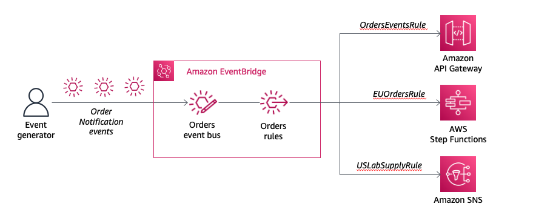

### Working with EventBridge rules



Rules match incoming events and routes them to targets for processing. A single rule can route to multiple targets, all of which are processed in parallel. Rules aren't processed in a particular order. A rule can customize the JSON sent to the target, by passing only certain parts or by overwriting it with a constant. EventBridge supports 28+ AWS service targets!

In this module, you will walk through the steps to create an Orders event bus rule to match an event with a com.aws.orders source and to send the event to an Amazon API Gateway endpoint, invoke a AWS Step Function, and send events to an Amazon Simple Notification Service (Amazon SNS) topic.

## Rule matching basics
Events in Amazon EventBridge are represented as JSON objects and have the following envelope signature:

```json
{
  "version": "0",
  "id": "6a7e8feb-b491-4cf7-a9f1-bf3703467718",
  "detail-type": "EC2 Instance State-change Notification",
  "source": "aws.ec2",
  "account": "111111111111",
  "time": "2017-12-22T18:43:48Z",
  "region": "us-west-1",
  "resources": [
    "arn:aws:ec2:us-west-1:123456789012:instance/ i-1234567890abcdef0"
  ],
  "detail": {
    "instance-id": " i-1234567890abcdef0",
    "state": "terminated"
  }
}

Rules use event patterns to select events and route them to targets. A pattern either matches an event or it doesn't. Event patterns are represented as JSON objects with a structure that is similar to that of events. For example, the following event pattern allows you to subscribe to only events from Amazon EC2.

1
2
3
{
  "source": [ "aws.ec2" ]
}

The pattern simply quotes the fields you want to match and provides the values you are looking for.

The sample event above, like most events, has a nested structure. Suppose you want to process all instance-termination events. Create an event pattern like the following.

1
2
3
4
5
6
7
{
  "source": [ "aws.ec2" ],
  "detail-type": [ "EC2 Instance State-change Notification" ],
  "detail": {
    "state": [ "terminated" ]
  }
}

It is important to remember the following about event pattern matching:

For a pattern to match an event, the event must contain all the field names listed in the pattern. The field names must appear in the event with the same nesting structure.

Other fields of the event not mentioned in the pattern are ignored; effectively, there is a "*" : "*" wildcard for fields not mentioned.

The matching is exact (character-by-character), without case-folding or any other string normalization.

The values being matched follow JSON rules: Strings enclosed in quotes, numbers, and the unquoted keywords true, false, and null.

Number matching is at the string representation level. For example, 300, 300.0, and 3.0e2 are not considered equal.

For more information on pattern matching, refer to the Events and Event Patterns in EventBridge  documentation.

Next steps
OK, now that you have explored EventBridge Rule patterns, let's begin the first challenge.
